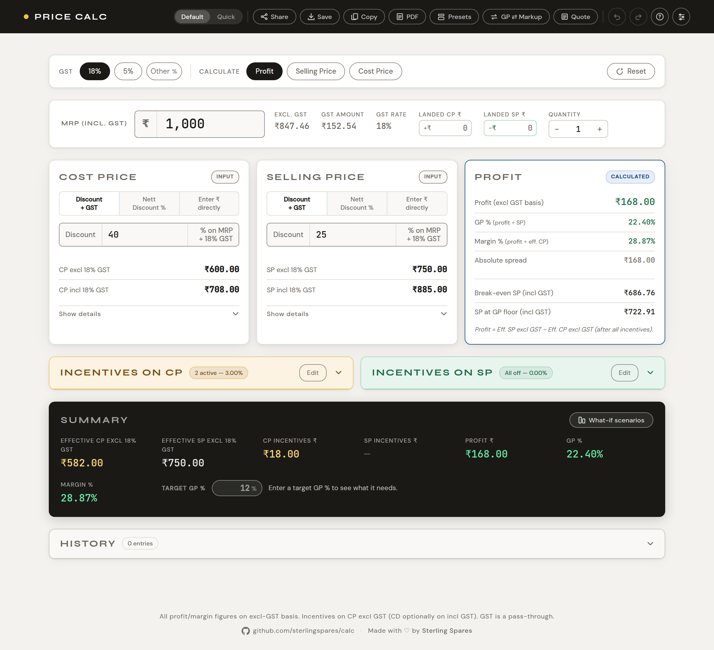
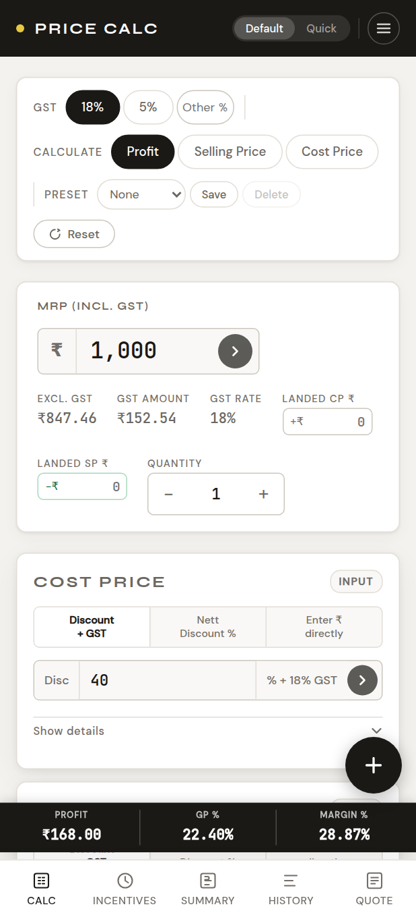

# Pricing Calculator

[](https://github.com/sterlingspares/calc/actions/workflows/tests.yml)         

**Live app:** [calc.sterlingspares.com](https://calc.sterlingspares.com)

An offline-first web app for MRP-based pricing and profit calculations in
automotive parts distribution. You enter a Maximum Retail Price, describe how
cost and selling price are discounted off it, layer on the incentives your
supplier and your customer actually give you, and it tells you what you make.

No build step, no framework, no runtime dependencies.



---

## What problem it solves

In Indian distribution, the **MRP** printed on the pack is a legal ceiling — no
one in the chain may sell above it. So price is not built up from cost; it is
discounted *down* from the MRP. A distributor buys at, say, 40% off MRP and
sells at 25% off. The gap is the business.

What makes that hard to hold in your head is that the invoice discount is not
the real one. On top of it sit **incentives** — cash discount for paying
promptly, early-bird for ordering in a window, quarterly and annual volume
rebates, seasonal schemes. None appear on the invoice line, all change what the
stock actually cost you. Some of them you receive; others you pass on to your
own customer. Meanwhile every figure has to be tracked both **excl GST** (what
profit is computed from, since the tax is passed through) and **incl GST** (what
you actually quote and negotiate).

This app does that arithmetic, live, so a quote can be checked before it is
given rather than regretted after.

### A worked example

The screenshot above, step by step. A part with an MRP of ₹1,000 at 18% GST,
bought at 40% off, sold at 25% off, with a 2% cash discount and 1% early-bird
rebate from the supplier:

| | | |
|---|---:|---|
| MRP (incl GST) | **₹1,000.00** | the printed ceiling |
| CP excl GST | ₹600.00 | 40% off |
| − CP incentives | ₹18.00 | 2% cash discount + 1% early bird |
| **Effective CP** | **₹582.00** | what the stock really cost |
| SP excl GST | ₹750.00 | 25% off — ₹885.00 incl GST, the quoted price |
| **Profit** | **₹168.00** | ₹750.00 − ₹582.00 |
| GP % | 22.40% | 168 ÷ 750 |
| Margin % | 28.87% | 168 ÷ 582 |
| Break-even SP | ₹686.76 | incl GST — below this you lose money |

Without the two incentives the same deal shows ₹150.00 profit and 20.00% GP.
That 3% off-invoice is a fifth of the profit, and it is exactly the part that is
easy to forget.

### Terms

| Term | Means |
|---|---|
| **MRP** | Maximum Retail Price — the ceiling printed on the pack. Every price is a discount off it |
| **CP** | Cost Price — what you pay your supplier |
| **SP** | Selling Price — what you charge your customer |
| **GST** | Goods and Services Tax. Auto parts are usually 18%, some 5% |
| **Incentive** | An off-invoice discount — cash discount, rebate, scheme — that changes real cost without changing the invoice line |
| **Effective CP / SP** | The price after incentives and landed costs. Profit is computed from these, not from the invoice figures |
| **Landed cost** | Per-unit freight, insurance or handling — added to CP inbound, deducted from SP outbound |
| **GP %** | Profit as a share of **selling** price |
| **Margin %** | Profit as a share of **cost** |

> Note the last two, which the trade uses in a specific way. **GP %** is
> profit ÷ SP; **Margin %** is profit ÷ CP. If you come from a finance
> background, "Margin %" here is what you would call *markup* — it is always the
> larger of the two, as in the example above.

---

## Contents

**Using it**
[Pricing](#pricing) ·
[Incentives & costs](#incentives--costs) ·
[Analysis & output](#analysis--output) ·
[Working with the app](#working-with-the-app) ·
[Mobile](#mobile) ·
[Keyboard shortcuts](#keyboard-shortcuts)

**Under it**
[Platform](#platform) ·
[Accessibility](#accessibility) ·
[Security](#security) ·
[Measured quality](#measured-quality) ·
[Tests](#tests) ·
[Architecture](#architecture)

---

## Quick start

```bash
git clone https://github.com/sterlingspares/calc.git
cd calc
python3 -m http.server 8000      # or any static server
```

Opening `index.html` from disk works too — the app runs, but the browser blocks
`file://` font requests, so it falls back to the system typeface.

```
index.html              markup only
assets/styles.css       all styling
assets/app.js           core behaviour
assets/app-extra.js     what-if, compare, quote, onboarding — loaded on demand
assets/fonts.css        self-hosted @font-face rules
assets/fonts/           three woff2 files
sw.js                   service worker
manifest.json           PWA manifest
_headers                response headers for the host
tests/                  test suite (dev-only)
docs/                   screenshots for this README
```

---

## Pricing

### MRP and GST

Every price derives from the Maximum Retail Price, and every price is shown in
two forms: **excl GST** for accounting and **incl GST** as the sticker price.

- **18%** (default) or **5%** — keyboard `1` / `2`
- **Any other rate** — type it into the **Other %** box in the control bar
  (0–100 %, decimals allowed). It feeds straight into every calculation, and
  all `excl/incl X% GST` labels update to match. The box highlights while a
  custom rate is live, so exactly one of the three options ever looks selected —
  and typing a rate that already has a pill (18 or 5) hands over to it and
  empties the box rather than leaving two controls filled in.

### Price input methods

CP and SP each have three independent input modes:

| Mode | How it works |
|---|---|
| **Discount excl GST** | Enter a % discount on MRP; yields the price excl GST |
| **Nett Discount incl GST** | Enter a % discount directly on the MRP incl GST |
| **Manual ₹ entry** | Type the price in rupees |

> In **Discount excl GST** mode the discount applies to the MRP *incl* GST and
> produces the price *excl* GST. MRP 1000 at 40% gives CP excl **600**, not
> `1000 / 1.18 × 0.6`. This trips people up when writing tests.

### Solve modes

Choose what the calculator computes and what you supply:

| Mode | You enter | It computes | Key |
|---|---|---|---|
| **Profit** (default) | MRP · CP · SP | Profit ₹, GP %, Margin % | `P` |
| **Selling Price** | MRP · CP · target profit | Selling Price | `L` |
| **Cost Price** | MRP · SP · target profit | Cost Price | `K` |

### Profit display

| Mode | Formula |
|---|---|
| **₹ Value** | Eff. SP excl GST − Eff. CP excl GST |
| **GP %** | Profit ÷ Eff. SP excl GST × 100 |
| **Margin %** | Profit ÷ Eff. CP excl GST × 100 |

### Quantity and order value

Set a **Quantity** in the MRP bar. Per-unit figures are unaffected; above 1 the
summary gains an order block:

| Row | Meaning |
|---|---|
| **Quantity** | Units in the order |
| **Order Value (incl GST)** | SP incl GST × qty |
| **Total Profit ₹** | Per-unit profit × qty |

Quantity is saved with history entries and included in the CSV export. Absolute
(₹) incentives are per-unit, consistent with every other figure.

### Rounding

Settings → **Rounding**: **Off**, **₹1**, **₹5**, or any step typed into the
**Other ₹** box (₹20, ₹0.50, ₹100 — anything above zero, decimals allowed).

Rounding applies to the incl-GST sticker price, with excl-GST and profit derived
from the rounded figure, so what you quote and what you bank stay consistent. It
covers the main calculator and every quote line, and persists in share links.

The live option is always highlighted — including the custom box, which fills
with the accent colour when a custom step is what's active. The step is also
shown in the field itself, so the state is never signalled by colour alone.
Typing a step that already has a chip (1 or 5) selects that chip and clears the
box, the same way the GST control behaves.

### Number formatting

Grouping follows the currency, not the app. Rupees group Indian-style
(₹98,76,54,321.55); every other currency groups in thousands
($987,654,321.55). Percentages show two decimal places.

### Currency

Rupees are the unit everything is *stored and calculated* in. The **Show**
control picks which side of the deal a foreign currency applies to, and in which
currency — twenty are available:

| Scope | What changes |
|---|---|
| **Cost** | CP, effective CP, CP incentives, inbound landed cost |
| **Sale** | SP, effective SP, SP incentives, outbound landed cost, profit, break-even, order value, rounding |
| **Cost & Sale** | both of the above |

Profit follows the **sale** side, because that is the currency the money arrives
in. **MRP is never converted** under any scope: it is a rupee price fixed by law,
and converting it would let a rate update restate the one figure in the deal that
cannot move.

Fields on a converted side are **entered in that currency too** — a box showing
`$` holds dollars. Switching currency re-expresses what you typed, so a ₹50
landed cost becomes `$0.52` rather than silently becoming fifty dollars.
Percentages are left alone. Whatever is on screen, the underlying deal is
unchanged: effective CP and SP in rupees are identical across all three scopes.

Rounding rounds the sticker price, so its step follows the sale side: a `$1`
step rounds the quote to whole dollars, and the rupee figure behind it is then
not round — which is the point when quoting abroad.

| | |
|---|---|
| **Rates** | Fetched from [open.er-api.com](https://open.er-api.com) — free, no key, updated daily |
| **When** | Never on load. Only when you first switch to a foreign currency, or press **Rates** |
| **Offline** | The last fetch is cached and reused, labelled with its age (`1 USD = ₹95.69 · 4h ago`) |
| **Override** | Settings → Currency takes a rate you type, for a contracted rate or no connection. Yours wins over the feed |
| **Scope** | Carried in share links along with the currency, so a link opens the way it was sent |
| **No rate** | Amounts show `—`. A rupee figure is never shown wearing a foreign symbol |

The rate is deliberately **not** carried in share links — only the currency is,
so the recipient fetches a current rate instead of inheriting a stale one.

---

## Incentives & costs

Incentives are the discounts that never appear on the invoice line — cash
discount, early-bird, quarterly and annual rebates, schemes. They change what
you *effectively* pay and receive, which is what the profit is actually made of.

```
Effective CP = CP excl GST − CP incentives + Landed CP
Effective SP = SP excl GST − SP incentives − Landed SP
```

### CP incentives

Five ship by default, each independently togglable:

| Code | Name (customisable) | Input |
|---|---|---|
| **CD** | Cash Discount | % or ₹ — on CP excl or incl GST (selectable) |
| **EB** | Early Bird Discount | % of CP excl GST |
| **QT** | Quarterly Discount | % of CP excl GST |
| **AN** | Annual Discount | % of CP excl GST |
| **SC** | Scheme | % of CP excl GST *or* fixed ₹ |

The panel footer shows **Total incentive ₹**, **Effective incentive % on CP** and
**Effective CP excl GST**.

### SP incentives

The same set applied against SP instead — for modelling what you give away, such
as a scheme passed on to the dealer. CD can be calculated on SP excl or incl GST,
and Scheme can be % or fixed ₹. The footer shows **Total SP incentive ₹**,
**Eff. incentive % on SP** and **Effective SP excl GST**.

### Editing incentives

Each panel has its own **Edit** button beside the collapse chevron. CP and SP are
edited independently — the two lists need not match.

| Action | How |
|---|---|
| **Rename** | The label becomes a text field — type a new name (max 30 chars) |
| **Delete** | Tap the red **⊖** badge on the row (iOS-style), then confirm |
| **Add** | Tap **+ Add incentive** below the grid |

Tap **Done** to leave edit mode. Tapping **Edit** on a collapsed panel expands it
first — the rows you are editing live inside it — and collapsing a panel while
editing counts as Done.

- **New incentives** get the same **% / ₹ Absolute** choice the Scheme row has:
  percentage deducts a share of the base price excl GST, absolute deducts a flat
  rupee value. They default to percentage, and the unit beside the input flips
  between `%` and `₹` to match. Each keeps its own setting, per panel.
- **Deleting** asks for confirmation, takes effect in the calculation
  immediately, and is undoable. The built-in five can be deleted too — including
  CD and Scheme, along with their extra option rows.
- Toggle states and entered values survive entering and leaving edit mode.
- Your list and custom names persist across sessions.

### Landed costs

Two per-unit fields in the MRP bar, both excl GST, pulling in opposite
directions:

| Field | Meaning | Effect |
|---|---|---|
| **Landed CP ₹** (`+₹`) | Inbound freight, insurance, handling | **Added** to effective CP |
| **Landed SP ₹** (`−₹`) | Outbound delivery, packing, freight to the customer | **Deducted** from effective SP |

Both flow through every derived figure — profit, GP %, margin, break-even, the
solver, history and share links. Direction is shown by the `+₹` / `−₹` prefix,
not only by colour.

Because the outbound cost is a flat amount taken off the top, break-even grosses
it up by the SP-incentive ratio: the list price has to cover it *before*
incentives take their proportion.

### Presets

Incentive setups repeat — one supplier's terms, one dealer's scheme. A preset
snapshots both panels entirely: the rows, their names, their % / ₹ modes, which
are switched on, the values in them, and the CD/Scheme base selectors.

The control bar carries the essentials — a dropdown to apply one, **Save** to
store what is on screen, and **Manage** for everything else. The manager is also
in **Settings → Presets**, or press `E`:

| Action | Where | What it does |
|---|---|---|
| Apply | dropdown | Replaces both panels with the saved setup |
| **Save** | control bar | Names and stores the current setup |
| **Load** | Manage | Same as the dropdown, from the list |
| **Rename** | Manage | Renames without touching the contents |
| **Update** | Manage | Replaces a saved preset with what is on screen |
| **Delete** | Manage | Removes it, after confirming |

Naming happens in the app's own dialog, not a browser `prompt()`. It validates
as you type: an empty name is refused, and a name that already exists warns that
saving will replace it — without blocking, since replacing is often the intent.

**Nothing is replaced or removed without a dialog in front of it.** Save always
asks for the name, Update and Delete always confirm, and cancelling any of them
leaves the stored preset exactly as it was. Every preset action is undoable.

Presets persist in `localStorage` and are re-validated on load, so a corrupted or
hand-edited entry is dropped rather than trusted.

---

## Analysis & output

### Summary

A sticky bar below the cards shows CP incl GST · SP incl GST · Effective CP ·
Effective SP · Profit ₹ · GP % · Margin %, with warnings when GP % or Margin %
fall below your floor limits.

### Break-even

Two thresholds, both quoted **incl GST** because that is what gets negotiated:

| Row | Meaning |
|---|---|
| **Break-even SP** | Price at which profit reaches zero |
| **SP at GP floor** | Price at which GP % hits your Settings floor |

Both are stated *before* SP incentives — those reduce what you actually receive,
so the quotable price is grossed back up accordingly.

### Target-margin solver

Below the break-even rows, enter a **Target GP %** and it answers the question
directly rather than making you converge on it by trial and error. What it says
depends on which side of the target you are on:

**Short of it** — the incentive you would need, the effective CP that implies,
and the gap from where you are now:

> Needs 14.20% total CP incentive (₹514.80 eff. CP). You have 9.00% — ₹31.20 more
> per unit. Currently 11.40%.

**Already past it** — how much room you have before you lose it. Asking what
incentive gets you *down* to a target has no useful answer, so it reports the
cushion on effective CP instead:

> Already there — GP is 25.00%, above the 12.00% target. Effective CP has ₹10.40
> of room per unit (up to ₹70.40) before GP drops to 12.00%.

**Sitting on it** — `Right on target — GP is 25.00%. No change needed.`

Targets outside 0–99.9% are refused by name (`Target GP % must be between 0 and
99.9`) rather than being mistaken for missing input, and if a reachable target
would need more incentive than the cost price itself, it says so rather than
printing a nonsense figure. Landed costs are accounted for throughout.

### What-if analysis

Three side-by-side SP scenarios (A · B · C) to compare before committing. Each
takes its own SP input (discount % or manual ₹) and shows SP, Profit ₹, GP % and
Margin %. The highest-GP scenario is highlighted automatically, and everything
updates live.

### Quote builder

A multi-line quoting tool — press `M`, or use **Quote** in the header / menu.

Each line takes a description, MRP, quantity and net CP/SP discounts, and
computes SP incl GST, line value, line profit and GP %. Lines below your GP floor
are flagged red. A totals row gives line count, total units, order value, total
profit and **blended GP %** across the quote.

| Action | Description |
|---|---|
| **Add line** | Append a blank line |
| **Add current calculation** | Pull MRP, quantity and both discounts in from the main calculator |
| **Export CSV** | Per-line breakdown plus a totals row |
| **Copy quote** | Formatted plain text, for email or WhatsApp |
| **Clear all** | Remove every line, after confirmation |

Lines use the calculator's current GST rate and rounding setting. Incentives are
**not** applied per line — enter the net discount you are quoting. The quote
persists across sessions.

### Copy, share and export

- **Copy summary** — formatted text block to the clipboard (`⌘/Ctrl + C`)
- **WhatsApp** — opens a pre-filled message
- **Email** — opens a mailto with the summary
- **PDF** — print-friendly layout via browser print (`Ctrl + P`)
- **Share link** — encodes the full calculator state into a URL

---

## Working with the app

### History

Calculations auto-save after 900 ms of inactivity once both CP and SP are filled
(toggleable in Settings). Up to **50 entries** are kept, across page reloads.

Each card shows time (relative, absolute on hover), tag, quantity if above 1,
MRP, CP excl, SP excl, CP incentives ₹, Profit ₹, GP %, Margin % and GST rate.

**Search, filter, tag**

- **Search** matches tags, GST rate, date and any numeric value in the entry
- **Filters** — `All` · `Profit +` · `Loss` · `Below floor` · `Tagged`
- **Tags** — **+ Tag** on any entry labels it (a dealer or customer name, max 24
  chars). Click to edit, clear to remove. Tags are searchable and exported.

The panel header shows `N of M` while a search or filter is active.

**Actions** — Save current · Compare (side-by-side against the current state with
↑↓ deltas for CP, SP, Profit, GP %, Margin %) · delete one entry (**×**) · Export
CSV · Clear all.

### Undo / redo

Every state-changing action is undoable: adding, deleting, renaming or retyping
an incentive, changing rounding, resetting, editing the quote, and all history
operations.

- **Undo / Redo** buttons in the header (Undo also in the mobile menu)
- `⌘/Ctrl + Z` and `⌘/Ctrl + ⇧ + Z` — these work even while typing in a field
- Destructive actions show a toast with an inline **Undo**
- Up to **40 steps** retained

### Settings

Grouped into four tabs — a nav rail on desktop, a scrollable strip of pills on
a phone — rather than one long scroll:

| Tab | Holds |
|---|---|
| **General** | Dark mode · Auto-save |
| **Pricing** | Floor limits · Rounding · Currency |
| **Features** | The eight switches · Saved presets |
| **Help** | App tour · Keyboard shortcuts |

Arrow keys, Home and End move between tabs, and a tab whose sections are all
switched off hides rather than leading nowhere.

| Setting | Description |
|---|---|
| **Dark mode** | Full dark colour scheme |
| **Minimum GP %** | Flags values red below this threshold |
| **Minimum Margin %** | Flags values red below this threshold |
| **Auto-save** | Toggle automatic history logging |
| **Rounding** | ₹1, ₹5, a custom step, or off |
| **Features** | Switch off anything you do not use |
| **Saved presets** | Open the preset manager |
| **Exchange rates** | Update now, and set a manual rate |
| **App tour** | Restart the onboarding walkthrough |
| **Keyboard shortcuts** | View all shortcuts |

Floor limits, auto-save preference and theme persist across sessions.

#### Turning features off

Not every distributor quotes abroad, pays freight separately or passes
incentives on to customers. **Settings → Features** switches any of these off,
and it disappears from the screen:

| | |
|---|---|
| **Presets** | the control-bar picker and the manager |
| **Quote builder** | the header button, menu item and bottom-nav tab |
| **What-if scenarios** | the button on the summary |
| **Currency conversion** | the Show control; the display returns to rupees |
| **Landed costs** | both fields in the MRP bar |
| **Target GP solver** | the row under break-even |
| **Incentives on CP** · **Incentives on SP** | the whole panel; the Incentives tab goes when both are off |

Switching one off **clears what it holds**, so it says what that is first —
*"This will clear 2 saved presets"* — and does nothing until you confirm. A
feature holding nothing goes quietly. Turning one back on is immediate and asks
nothing, but does not bring cleared values back.

Off means unreachable, not merely hidden: the keyboard shortcut, the bottom-nav
tab and a restored share link all stop opening it, and a value left in a hidden
field cannot move a figure — a disabled landed cost reads as zero even if the
box still has something in it. Every switch is undoable and persists across
sessions.

---

## Quick (flashcard) mode

A mobile-oriented 4-step card interface — `Q` toggles it.

1. **MRP** — MRP, GST rate, solve-for mode
2. **CP** — cost price (discount % or manual ₹)
3. **SP** — selling price (or profit, when solving for SP/CP)
4. **Result** — profit, GP %, Margin %, effective prices

Swipe left/right or use `→` / `Enter` and `←` to move between cards. Quick mode
remembers its own last inputs and restores them when you return.

---

## Mobile



The layout adapts below 800 px.

- **Sticky result bar** — Profit, GP % and Margin % stay pinned above the bottom
  nav in Default mode, so you can watch them move while editing discounts instead
  of scrolling to the summary and back. Values below your floors turn amber;
  losses turn red.
- **Floating action button** — a thumb-reachable ⊕ above the bottom-right corner
  opens the six primary actions (Save to history, Copy summary, WhatsApp, Share
  link, Email, Export PDF), which otherwise live in the top header. Tap the scrim
  or press Escape to dismiss. Default mode only.
- **Bottom nav** — Calc · Incentives · Summary · History · Quote
- **Pull to reset** — in Default mode, pull down from the top of the page to
  reveal the reset bar; past 90 px, release to reset all inputs and clear the
  saved session.
- **Quote builder** — stacked card per line, no sideways scrolling, action bar
  pinned to the bottom of the dialog. Rotating switches layout automatically.
- **Dialogs** — every modal is constrained to the viewport with a scrolling body,
  so its buttons are always reachable.
- **Touch targets** — controls meet the 44 px guidance, with press feedback.
- **Zoom** — pinch-zoom works; double-tap zoom is suppressed only on controls.

---

## Keyboard shortcuts

| Key | Action | Key | Action |
|---|---|---|---|
| `?` | Keyboard shortcuts | `1` | GST 18% |
| `S` | Settings | `2` | GST 5% |
| `E` | Saved presets | `P` | Solve for Profit |
| `M` | Quote builder | `L` | Solve for Selling Price |
| `R` | Reset all inputs | `K` | Solve for Cost Price |
| `Q` | Default / Quick mode | `⌘/Ctrl + Z` | Undo |
| `⌘/Ctrl + S` | Save to history | `⌘/Ctrl + ⇧ + Z` | Redo |
| `⌘/Ctrl + C` | Copy summary | | |

Any GST rate other than 18% or 5% goes in the **Other %** box. `P` and `S` were
taken by Solve-for-Profit and Settings, so presets use `E`.

---

## Platform

### Offline / PWA

- **Service worker** (`sw.js`) precaches the markup, both script bundles, the
  stylesheet, all three fonts and the icons, and serves them
  stale-while-revalidate — the app works fully offline after the first visit.
- **Web app manifest** — installable as a standalone app on Android and iOS.
- A banner appears when a new version is deployed.

### State persistence

| Key | Contents |
|---|---|
| `pc-state` | Full calculator state (MRP, quantity, CP/SP inputs, modes, incentives, landed costs, rounding, floor limits, auto-save pref) |
| `pc-history` | History array — up to 50 entries |
| `pc-labels` | Custom incentive names and the CP/SP incentive lists |
| `pc-presets` | Saved incentive presets |
| `pc-fx` | Cached exchange rates, their age, and any manual override |
| `pc-features` | Which optional features are switched off |
| `pc-qstate` | Quick mode inputs and settings |
| `pc-quote` | Quote builder lines |
| `pc-theme` | Dark / light preference |
| `ob-done` | Onboarding completion flag |

A URL share (`?s=…`) encodes calculator state as base64 JSON and takes
**priority over localStorage** on load. Every field is allow-listed on the way
in — an unrecognised or malformed payload is discarded, not partially applied.

---

## Accessibility

Targets **WCAG 2.1 Level AA**, verified on every push. Lighthouse accessibility
score: **100**.

- **Contrast** — every text/background pair meets 4.5:1 in both themes, and
  every interactive control is identifiable at 3:1 (WCAG 1.4.11) by its border
  or its fill. Control boundaries use a dedicated `--border-ctrl` token rather
  than the softer decorative `--border`, and the selected state of a pill is
  held to the same bar — in the dark theme it was previously within 1.09:1 of
  the surface behind it, so only the label brightness said it was chosen
- **Structure** — one `h1`, section headings throughout, `main`/`nav`/`header`/
  `footer` landmarks, and a skip link as the first tab stop
- **Names** — every input and button exposes an accessible name, and visible
  labels are contained in their accessible names
- **Keyboard** — everything is reachable and operable; panel headers are real
  buttons with `aria-expanded`; no handler is mouse-only
- **Focus** — a visible `:focus-visible` ring in a soft mid grey rather than
  near-black (on the wrapper, for inputs styled that way), a focus trap in every
  dialog, and focus returned to the opener on close. Confirmation dialogs focus
  **Cancel**, never the destructive button
- **Live regions** — results are announced politely and debounced, including
  floor-limit warnings
- **Colour is never the only signal** — landed-cost direction carries a `+₹`/`−₹`
  prefix, deltas carry ↑/↓ glyphs, the active rounding step is printed in its
  field
- **Motion** — `prefers-reduced-motion` disables animation and transitions
- **Zoom** — pinch-zoom to 5× is available; only double-tap zoom is suppressed,
  per control

Checked with axe-core (WCAG 2.0/2.1 A + AA + best practice) across the default
view, all six dialogs and the FAB menu, in both themes — plus direct assertions
for contrast, headings, focus behaviour and reduced motion, which axe cannot
evaluate without layout.

## Security

- **Content Security Policy** via meta tag, with **`script-src 'self'`** — no
  `'unsafe-inline'`. The markup carries no `on*` attributes at all; every
  interaction is routed through a delegated handler registry keyed by
  `data-click` / `data-input` / `data-change` attributes.
- **One external origin, declared narrowly.** Fonts and icons are same-origin;
  the only outbound request is the exchange-rate feed, so `connect-src` is
  `'self' https://open.er-api.com` and nothing else. The app makes exactly one
  `fetch()` call, never during load, and works fully offline without it — a
  browser test confirms the policy admits that host and refuses any other.
- **One escaping helper** (`escHtml`) for every value interpolated into markup,
  rather than escaping open-coded per call site.
- **Stored data is untrusted.** Incentive keys from `localStorage` are validated
  against `/^[A-Za-z0-9_-]{1,24}$/` before use in element ids, and malformed
  entries are dropped with a console warning. Share-link payloads are
  allow-listed field by field.
- **Response headers** ship in `_headers` — `X-Frame-Options: DENY` and
  `frame-ancestors 'none'` (neither can be set from a meta tag), plus `nosniff`,
  `Referrer-Policy`, `Permissions-Policy` and COOP/CORP.

> `_headers` is understood by Netlify and Cloudflare Pages. GitHub Pages ignores
> it — on that host the clickjacking protection has to move into a CDN or proxy
> in front.

---

## Measured quality

Every number here is reproducible from the repo — none is hand-written.

| Metric | Value | Reproduce with |
|---|---|---|
| Tests | 1303 passing, 7 suites | `npm test` |
| Statement coverage | **82.4%** (app.js 86.0%, app-extra.js 68.5%) | `npm run coverage` |
| Lighthouse Performance | **98** | `npm i -D lighthouse && npm run lighthouse` |
| Lighthouse Accessibility | **100** | ” |
| Lighthouse Best Practices | **100** | ” |
| Lighthouse SEO | 60 | ” |

Lighthouse runs against a local server that gzips and sets the same cache headers
as `_headers`, on emulated mobile with throttling — so the scores reflect a
realistic deployment rather than an unconfigured static host. Measured: FCP 1.5s,
LCP 2.1s, CLS 0. Total Blocking Time is noisy on a shared machine — 0ms on three
runs of four, 30ms on the other.

**On the SEO score:** it is capped entirely by
`<meta name="robots" content="noindex, nofollow">`. `is-crawlable` is the only
failing audit, and it fails by design — this is an internal tool that should not
be indexed. Removing the meta tag would score 100 and is not wanted.

Coverage is measured by mapping V8 coverage back to each bundle. The app runs
inside jsdom as an inline script, so c8 and nyc attribute everything to the
document URL; `tests/coverage.js` recovers the offsets and folds in the browser
suite's own Chromium coverage. No badge is generated automatically — re-run the
commands after significant changes.

---

## Tests

1303 assertions across seven suites. They load the real `index.html`,
`assets/styles.css` and both script bundles, and drive the actual application
functions — no application code is mocked. **Node 22 or newer.**

```bash
npm install   # jsdom, dev-only
npm test
```

| Suite | Assertions | Covers |
|---|---|---|
| `features` | 878 | GST, incentives, quantity, landed costs, rounding, undo/redo, quote maths, history |
| `errors` | 33 | every failure path logs; a clean run stays silent; storage and payload recovery |
| `mobile` | 78 | modal layering, touch targets, sticky result bar, responsive quote layouts |
| `fab` | 50 | floating action button behaviour and z-index ordering |
| `modes` | 85 | solve modes, price input modes, what-if, comparison, Quick mode, wizard, share-link round trip, theming, auto-save |
| `a11y` | 103 | contrast ratios, structure, names, keyboard operability, focus trap, live regions, reduced motion, axe-core |
| `browser` | 76 | real Chromium over HTTP: asset loading, CSS cascade, `defer` timing, clicks, dialogs, mobile viewport, axe with layout |

Individual suites: `npm run test:features`, `test:errors`, `test:mobile`,
`test:fab`, `test:modes`, `test:a11y`, `test:browser`. Full assertion output:
`npm run test:verbose`.

The first six run in jsdom and need nothing beyond `npm install`. The seventh
drives a real browser and **skips itself** if Chromium is unavailable, so
`npm test` still passes without one:

```bash
npx playwright install chromium   # only needed for the browser suite
```

Every push and pull request runs them via GitHub Actions — the jsdom suites on
Node 22 and 24, and the browser suite in a dedicated job with `REQUIRE_BROWSER=1`
so a missing browser fails rather than silently skips. See
[`tests/README.md`](tests/README.md) for how the harness works and how to add a
suite.

---

## Architecture

Static files, served as-is. No bundler, transpiler or minifier — what is in the
repo is what the browser runs.

- **`index.html`** is markup only. It carries no inline script and no `on*`
  attributes; elements declare intent with `data-click`, `data-input`,
  `data-change`, `data-focus` and `data-blur`, and a small delegated dispatcher
  looks the handler up in a registry. That is what lets the CSP be
  `script-src 'self'`.
- **`assets/app.js`** is the core: calculation, incentives, history, settings,
  persistence. Loaded with `defer`, so the DOM is parsed before it initialises.
- **`assets/app-extra.js`** holds what-if, comparison, the quote builder and
  onboarding. It is fetched on first use and warmed up during idle time, keeping
  it off the critical path.
- Plain ES5-compatible browser JavaScript throughout — no framework, no polyfills.
- **Fonts are self-hosted**: Syne (headings), DM Sans (UI), JetBrains Mono
  (numbers), latin subset, one variable woff2 per family.
- `package.json` exists only for the test suite; the app itself has no runtime
  dependencies.

MIT Licence.
